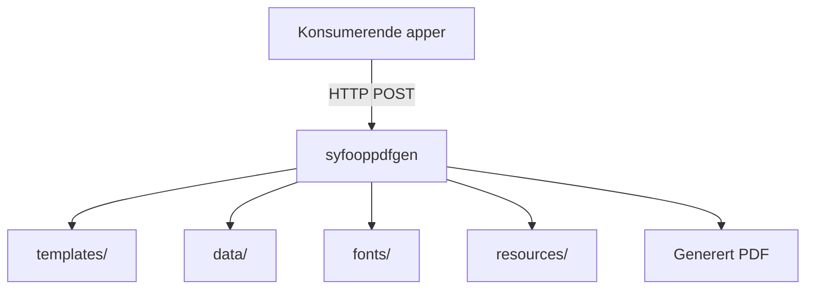

# Syfooppdfgen

[](https://github.com/navikt/syfooppdfgen/actions/workflows/build-and-deploy.yaml)

## Miljøer

[🚀 Produksjon](https://syfooppdfgen.intern.nav.no)

[🛠️ Utvikling](https://syfooppdfgen.intern.dev.nav.no)

## Formålet med repoet

`syfooppdfgen` er en delt PDF-tjeneste for sykefraværsoppfølging. Repoet bygger på [pdfgen](https://github.com/navikt/pdfgen) og inneholder maler, eksempeldata, fonter og statiske ressurser som brukes til å rendre PDF-er for flere applikasjoner.

Tjenesten deployes på NAIS og eksponerer PDF-endepunkter på formen `/api/v1/genpdf/<application>/<template>`.

## Oversikt



## Innhold i repoet

| Katalog | Innhold |
| --- | --- |
| `templates/` | Handlebars-maler organisert som `<application>/<template>.hbs` |
| `data/` | Eksempeldata for lokal utvikling og forhåndsvisning, organisert som `<application>/<template>.json` |
| `fonts/` | Fonter som brukes når PDF-ene rendres |
| `resources/` | Statiske filer som SVG-er og bilder brukt i malene |

## Hvor malene brukes

Malene i dette repoet brukes av andre applikasjoner som sender JSON til `syfooppdfgen` og får PDF tilbake som byte-array fra et `genpdf`-endepunkt.

### Verifiserte konsumenter

| Applikasjon | Bruksområde | Endepunkt |
| --- | --- | --- |
| `syfo-oppfolgingsplan-backend` | PDF for oppfolgingsplan | `/api/v1/genpdf/oppfolgingsplan/oppfolgingsplan_v1` |
| `meroppfolging-backend` | Brev og kvitteringer i mer oppfølging | `/api/v1/genpdf/oppfolging/mer_veiledning_for_reserverte` og `senoppfolging/*` |
| `ismeroppfolging` | Kartlegging | `/api/v1/genpdf/kartlegging/utsending` |

### Andre kjente innkommende konsumenter

NAIS access policy viser også at `lps-oppfolgingsplan-mottak` har tilgang til tjenesten. `syfooppfolgingsplanservice` ligger fortsatt i access policy, men er legacy og forventes fjernet, så den bør ikke regnes som en fremtidsrettet hovedkonsument.

## Lokal utvikling med mise

Repoet bruker [mise](https://mise.jdx.dev/) som inngang for lokale utvikleroppgaver. Installer `mise` lokalt, og bruk `mise tasks ls` for å se hvilke kommandoer som er tilgjengelige i repoet.

### Forutsetninger

- Docker eller Colima med fungerende Docker-daemon
- `mise`

### Vanlig arbeidsflyt

```bash
mise tasks ls
mise run dev-detached
```

Dette starter `pdfgen` via Docker Compose med disse lokale mountene:

| Lokal katalog | Mount i container |
| --- | --- |
| `templates/` | `/app/templates` |
| `fonts/` | `/app/fonts` |
| `data/` | `/app/data` |
| `resources/` | `/app/resources` |

Containeren kjører med `DEV_MODE=true` og `DISABLE_PDF_GET=false`. Det gjør at du kan åpne testdata direkte i nettleseren på:

`http://localhost:9091/api/v1/genpdf/<application>/<template>`

Når du er ferdig:

```bash
mise run stop
```

Hvis du vil se loggene i terminalen mens du jobber, bruk `mise run dev` i stedet for `mise run dev-detached`.

### Windows

Windows er ikke prioritert utviklingsplattform lenger. Hvis du likevel kjører lokalt på Windows, bør du fortsatt passe på at malfilene bruker LF-linjeskift (`\n`) og ikke CRLF (`\r\n`), siden dette kan påvirke hvordan PDF-ene rendres.

## Drift og deploy

Docker-imaget bygges i GitHub Actions og deployes til NAIS for dev og prod. Applikasjonen eksponerer health checks og Prometheus-metrikker, og er tilgjengelig for et begrenset sett med interne konsumenter via access policy.

## Kontakt

For NAV-ansatte: ta kontakt i Slack-kanalen `#esyfo`.
