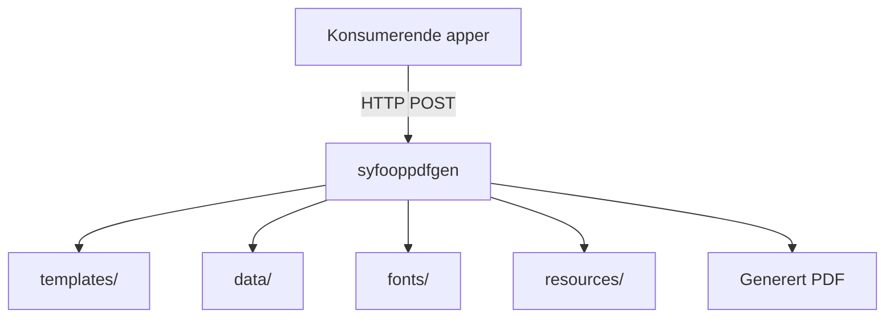

# Syfooppdfgen

## Miljøer

[🚀 Produksjon](https://syfooppdfgen.intern.nav.no)

[🛠️ Utvikling](https://syfooppdfgen.intern.dev.nav.no)

## Formålet med repoet

`syfooppdfgen` er en delt PDF-tjeneste for sykefraværsoppfølging. Repoet bygger på [pdfgen](https://github.com/navikt/pdfgen) og inneholder maler, eksempeldata, fonter og statiske ressurser som brukes til å rendre PDF-er for flere applikasjoner.

Tjenesten deployes på NAIS og eksponerer PDF-endepunkter på formen `/api/v1/genpdf/<application>/<template>`.

## Oversikt

## Innhold i repoet

| Katalog | Innhold |
| --- | --- |
| `templates/` | Handlebars-maler organisert som `<application>/<template>.hbs` |
| `data/` | Eksempeldata for lokal utvikling og forhåndsvisning, organisert som `<application>/<template>.json` |
| `fonts/` | Fonter som brukes når PDF-ene rendres |
| `resources/` | Statiske filer som SVG-er og bilder brukt i malene |

## Drift og deploy

Docker-imaget bygges i GitHub Actions og deployes til NAIS for dev og prod. Applikasjonen eksponerer health checks og Prometheus-metrikker, og er tilgjengelig for et begrenset sett med interne konsumenter via access policy.

## Kontakt

For NAV-ansatte: ta kontakt i Slack-kanalen `#esyfo`.
