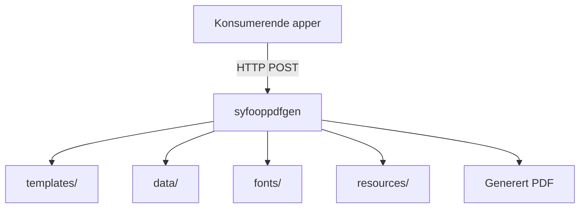

# Syfooppdfgen

[](https://github.com/navikt/syfooppdfgen/actions/workflows/build-and-deploy.yaml)

## Miljøer

[🚀 Produksjon](https://syfooppdfgen.intern.nav.no)

[🛠️ Utvikling](https://syfooppdfgen.intern.dev.nav.no)

## Formålet med repoet

`syfooppdfgen` er en delt PDF-tjeneste for sykefraværsoppfølging. Repoet bygger på [pdfgen](https://github.com/navikt/pdfgen) og inneholder maler, eksempeldata, fonter og statiske ressurser som brukes til å rendre PDF-er for flere applikasjoner.

Tjenesten deployes på NAIS og eksponerer PDF-endepunkter på formen `/api/v1/genpdf/<application>/<template>`.

## Oversikt



## Innhold i repoet

| Katalog | Innhold |
| --- | --- |
| `templates/` | Handlebars-maler organisert som `<application>/<template>.hbs` |
| `data/` | Eksempeldata for lokal utvikling og forhåndsvisning, organisert som `<application>/<template>.json` |
| `fonts/` | Fonter som brukes når PDF-ene rendres |
| `resources/` | Statiske filer som SVG-er og bilder brukt i malene |

## Hvordan malene fungerer

Både `templates/` og `data/` følger samme struktur: `<application>/<template>`. Det gjør at én mal og ett eksempeldata-sett kan kobles direkte sammen under lokal utvikling.

Eksempler fra repoet:

| Type | Eksempel |
| --- | --- |
| Mal | `templates/oppfolging/oppfolgingsplanlps.hbs` |
| Eksempeldata | `data/oppfolging/oppfolgingsplanlps.json` |
| Mal | `templates/oppfolgingsplan/oppfolgingsplan_v1.hbs` |
| Eksempeldata | `data/oppfolgingsplan/oppfolgingsplan_v1.json` |
| Mal | `templates/kartlegging/utsending.hbs` |
| Eksempeldata | `data/kartlegging/utsending.json` |

Flyten er i praksis:

1. En konsument sender JSON til `POST /api/v1/genpdf/<application>/<template>`.
2. `pdfgen` finner riktig Handlebars-mal i `templates/`.
3. Malen rendres med data fra requesten, samt fonter og ressurser fra repoet.
4. Resultatet returneres som PDF.

Under lokal utvikling kan du i tillegg bruke `GET /api/v1/genpdf/<application>/<template>` når `DISABLE_PDF_GET=false`. Da brukes eksempeldata fra `data/<application>/<template>.json`, som gjør det enkelt å iterere på en mal og oppdatere PDF-forhåndsvisningen i nettleseren.

## Hvor malene brukes

Malene i dette repoet brukes av andre applikasjoner som sender JSON til `syfooppdfgen` og får PDF tilbake som byte-array fra et `genpdf`-endepunkt.

### Verifiserte konsumenter

| Applikasjon | Bruksområde | Endepunkt |
| --- | --- | --- |
| `syfo-oppfolgingsplan-backend` | PDF for oppfolgingsplan | `/api/v1/genpdf/oppfolgingsplan/oppfolgingsplan_v1` |
| `meroppfolging-backend` | Brev og kvitteringer i mer oppfølging | `/api/v1/genpdf/oppfolging/mer_veiledning_for_reserverte` og `senoppfolging/*` |
| `ismeroppfolging` | Kartlegging | `/api/v1/genpdf/kartlegging/utsending` |
| `lps-oppfolgingsplan-mottak` | Mottak og videre behandling av oppfølgingsplan fra LPS | Tilgang er definert i NAIS access policy, eksakt endepunkt er ikke verifisert her |

## Lokal utvikling med mise

Repoet bruker [mise](https://mise.jdx.dev/) som inngang for lokale utvikleroppgaver. Installer `mise` lokalt, og bruk `mise tasks` for å se hvilke kommandoer som er tilgjengelige i repoet.

### Forutsetninger

- Docker Desktop eller Colima med fungerende Docker-daemon
- `mise`

### Nyttige oppgaver

| Kommando | Beskrivelse |
| --- | --- |
| `mise tasks` | Vis tilgjengelige oppgaver |
| `mise run dev` | Start tjenesten og vis logger i terminalen |
| `mise run dev-detached` | Start tjenesten i bakgrunnen |
| `mise run stop` | Stopp lokal kjøring |
| `mise run build` | Bygg Docker-imaget fra `Dockerfile` |
| `mise run open-example-pdf` | Åpne en eksempel-PDF lokalt i nettleseren og skriv ut ferske logger |

### Vanlig arbeidsflyt

```bash
mise tasks
mise run dev-detached
```

Dette starter `pdfgen` via Docker Compose med disse lokale mountene:

| Lokal katalog | Mount i container |
| --- | --- |
| `templates/` | `/app/templates` |
| `fonts/` | `/app/fonts` |
| `data/` | `/app/data` |
| `resources/` | `/app/resources` |

Containeren kjører med `DEV_MODE=true` og `DISABLE_PDF_GET=false`. Det gjør at du kan åpne testdata direkte i nettleseren på:

`http://localhost:9091/api/v1/genpdf/<application>/<template>`

### Eksempelflyt: generer en PDF lokalt

Bruk `mise run open-example-pdf` for å starte lokal kjøring ved behov, åpne en eksempel-PDF i nettleseren og skrive ut ferske `pdfgen`-logger i terminalen. Oppgaven bruker malen `templates/oppfolgingsplan/oppfolgingsplan_v1.hbs` sammen med eksempeldata fra `data/oppfolgingsplan/oppfolgingsplan_v1.json`, uten å lagre PDF-en lokalt.

Eksempler:

- `http://localhost:9091/api/v1/genpdf/oppfolging/oppfolgingsplanlps`
- `http://localhost:9091/api/v1/genpdf/oppfolgingsplan/oppfolgingsplan_v1`
- `http://localhost:9091/api/v1/genpdf/kartlegging/utsending`

Når du er ferdig:

```bash
mise run stop
```

Hvis du vil se loggene i terminalen mens du jobber, bruk `mise run dev` i stedet for `mise run dev-detached`.

## Drift og deploy

Docker-imaget bygges i GitHub Actions og deployes til NAIS for dev og prod. I image-builden kopieres `templates/`, `fonts/` og `resources/` inn i containeren, mens `data/` primært brukes til lokal utvikling. Applikasjonen eksponerer health checks og Prometheus-metrikker, og er tilgjengelig for et begrenset sett med interne konsumenter via access policy.

## Kontakt

For NAV-ansatte: ta kontakt i Slack-kanalen `#esyfo`.
