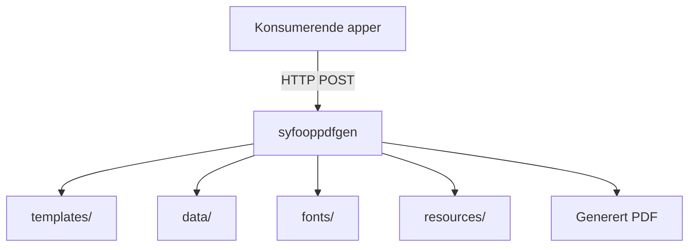

# Syfooppdfgen

## Miljøer

[🚀 Produksjon](https://syfooppdfgen.intern.nav.no)

[🛠️ Utvikling](https://syfooppdfgen.intern.dev.nav.no)

## Formålet med repoet

`syfooppdfgen` er en delt PDF-tjeneste for sykefraværsoppfølging. Repoet bygger på [pdfgen](https://github.com/navikt/pdfgen) og inneholder maler, eksempeldata, fonter og statiske ressurser som brukes til å rendre PDF-er for flere applikasjoner.

Tjenesten deployes på NAIS og eksponerer PDF-endepunkter på formen `/api/v1/genpdf/<application>/<template>`.

## Oversikt

## Innhold i repoet

| Katalog      | Innhold                                                                                             |
| ------------ | --------------------------------------------------------------------------------------------------- |
| `templates/` | Handlebars-maler organisert som `<application>/<template>.hbs`                                      |
| `data/`      | Eksempeldata for lokal utvikling og forhåndsvisning, organisert som `<application>/<template>.json` |
| `fonts/`     | Fonter som brukes når PDF-ene rendres                                                               |
| `resources/` | Statiske filer som SVG-er og bilder brukt i malene                                                  |

## Hvordan malene fungerer

Både `templates/` og `data/` følger samme struktur: `<application>/<template>`. Det gjør at én mal og ett eksempeldata-sett kan kobles direkte sammen under lokal utvikling.

Eksempler fra repoet:

| Type         | Eksempel                                           |
| ------------ | -------------------------------------------------- |
| Mal          | `templates/oppfolging/oppfolgingsplanlps.hbs`      |
| Eksempeldata | `data/oppfolging/oppfolgingsplanlps.json`          |
| Mal          | `templates/oppfolgingsplan/oppfolgingsplan_v1.hbs` |
| Eksempeldata | `data/oppfolgingsplan/oppfolgingsplan_v1.json`     |
| Mal          | `templates/kartlegging/utsending.hbs`              |
| Eksempeldata | `data/kartlegging/utsending.json`                  |

Flyten er i praksis:

1. En konsument sender JSON til `POST /api/v1/genpdf/<application>/<template>`.
2. `pdfgen` finner riktig Handlebars-mal i `templates/`.
3. Malen rendres med data fra requesten, samt fonter og ressurser fra repoet.
4. Resultatet returneres som PDF.

Under lokal utvikling kan du i tillegg bruke `GET /api/v1/genpdf/<application>/<template>` når `DISABLE_PDF_GET=false`. Da brukes eksempeldata fra `data/<application>/<template>.json`, som gjør det enkelt å iterere på en mal og oppdatere PDF-forhåndsvisningen i nettleseren.

## Hvor malene brukes

Malene i dette repoet brukes av andre applikasjoner som sender JSON til `syfooppdfgen` og får PDF tilbake som byte-array fra et `genpdf`-endepunkt.

### Verifiserte konsumenter

| Applikasjon                    | Bruksområde                                            | Endepunkt                                                                         |
| ------------------------------ | ------------------------------------------------------ | --------------------------------------------------------------------------------- |
| `syfo-oppfolgingsplan-backend` | PDF for oppfolgingsplan                                | `/api/v1/genpdf/oppfolgingsplan/oppfolgingsplan_v1`                               |
| `meroppfolging-backend`        | Brev og kvitteringer i mer oppfølging                  | `/api/v1/genpdf/oppfolging/mer_veiledning_for_reserverte` og `senoppfolging/*`    |
| `ismeroppfolging`              | Kartlegging                                            | `/api/v1/genpdf/kartlegging/utsending`                                            |
| `lps-oppfolgingsplan-mottak`   | Mottak og videre behandling av oppfølgingsplan fra LPS | Tilgang er definert i NAIS access policy, eksakt endepunkt er ikke verifisert her |

## Lokal utvikling med mise

Installer [mise](https://mise.jdx.dev/) og sørg for at Docker Desktop eller Colima kjører. Bruk `mise tasks` for å se tilgjengelige oppgaver.

For vanlig lokal utvikling holder det som regel å bruke `mise run open-example-pdf`. Da startes tjenesten ved behov, en eksempel-PDF åpnes i nettleseren, og ferske `pdfgen`-logger skrives ut i terminalen.

Docker Compose monterer disse katalogene lokalt:

| Lokal katalog | Mount i container |
| ------------- | ----------------- |
| `templates/`  | `/app/templates`  |
| `fonts/`      | `/app/fonts`      |
| `data/`       | `/app/data`       |
| `resources/`  | `/app/resources`  |

Med `DEV_MODE=true` og `DISABLE_PDF_GET=false` kan du også åpne testdata direkte i nettleseren på `http://localhost:9091/api/v1/genpdf/<application>/<template>`.

Andre urleksempler:

- `http://localhost:9091/api/v1/genpdf/oppfolging/oppfolgingsplanlps`
- `http://localhost:9091/api/v1/genpdf/kartlegging/utsending`

Når du er ferdig, stopp med `mise run stop`.

## Drift og deploy

Docker-imaget bygges i GitHub Actions og deployes til NAIS for dev og prod. I image-builden kopieres `templates/`, `fonts/` og `resources/` inn i containeren, mens `data/` primært brukes til lokal utvikling. Applikasjonen eksponerer health checks og Prometheus-metrikker, og er tilgjengelig for et begrenset sett med interne konsumenter via access policy.

## Kontakt

For NAV-ansatte: ta kontakt i Slack-kanalen `#esyfo`.
